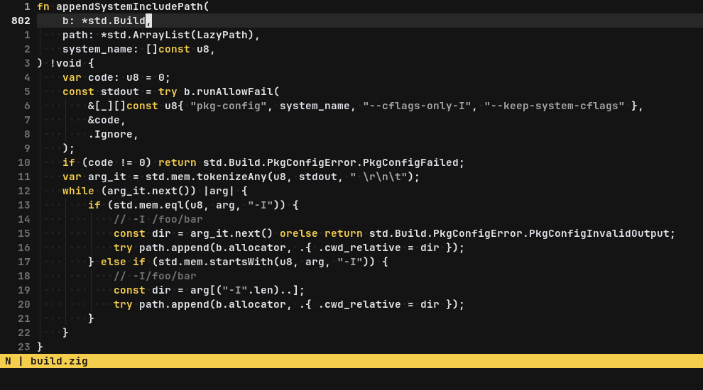

<div align="center">
  <h1>Silentium for Neovim</h1>
  
</div>

Pragmatic, logical, and monochrome theme for Neovim.
Our goal is to increase reading speed and reduce eye strain by highlighting
only what is necessary. Just install without `setup()` and go!

## Customize accent color

Silentium theme has a set of accent colors that fit perfectly into the palette,
just throw any color into `setup()`:

```lua
local silentium = require("silentium")
silentium.setup({ accent = silentium.accents.peach })
```

Or use your own color:

```lua
silentium.setup({ accent = "#E57AA4" })
```

## Customize other colors

```lua
silentium.setup({ dark = "#131313" })
```

Default palette:

```lua
silentium.setup({
	accent = silentium.accents.yellow,
	white = "#E6E6E6",
	light_gray = "#A6A6A6",
	gray = "#737373",
    ghost = "#404040",
	dark_gray = "#282828",
	dark = "#141414",
	diff_add = "#273C29",
	diff_change = "#4D4322",
	diff_delete = "#492523",
	diff_text = "#857131",
})
```

## Random accent color per session

Fresh accent every time you open Neovim

```lua
local silentium = require("silentium")
local accents = vim.tbl_keys(silentium.accents)
local random_accent = accents[math.random(#accents)]

silentium.setup({
  accent = silentium.accents[random_accent]
})
```

## Plugin integrations

Currently, silentium.nvim does not include any external plugin configurations
or custom highlight group definitions. The scope of this colorscheme is solely
on the core Neovim highlight groups. Therefore, if you encounter highlighting
issues with a specific plugin, adding that plugin's highlight groups
definitions to the colorscheme is not an option.

It's worth clarifiying that a "highlighting issue" refers to any highlighting
that makes the plugin difficult to use, such as unreadable text or invisible
elements. Subjections and preferences for highlighting specific details in
external plugins fall outside the scope of silentium.nvim and should be
addressed in the user's personal configuration or fork. If you sure you
encounter a valid colorscheme issue, please follow these steps:

First, set the default Neovim colorscheme and verify that the issue resolves,
ensuring the plugin properly links to core highlight groups. If the problem
persists, it is likely a fault of the plugin, not the colorscheme. In this
case, please do not submit a patch with custom highlight groups; instead,
report the bug to the plugin. This may lead to a permanent fix that benefits
all colorschemes, including built-in ones.

If the issue is specific to this colorscheme, you can open an issue, ideally
including screenshots that demonstrate the issue with silentium.nvim compared
to the default colorscheme. After identifying the problematic highlight group
link, the appropriate fix would involve modifying the base group to align with
the plugin's expectations, which are usually met by the default colorscheme.

However, there's a low probability that the plugin links everything correctly,
it works fine with the default colorscheme, but modifying the base group to
satisfy both the plugin and the colorscheme is not feasible. In this case
adding highlight groups for external plugin can be justified, we're still on
the way to encountering a case where this is truly necessary.

## Extras

Extra color configs for other tools can be found in
[GitHub organization](https://github.com/silentium-theme).
